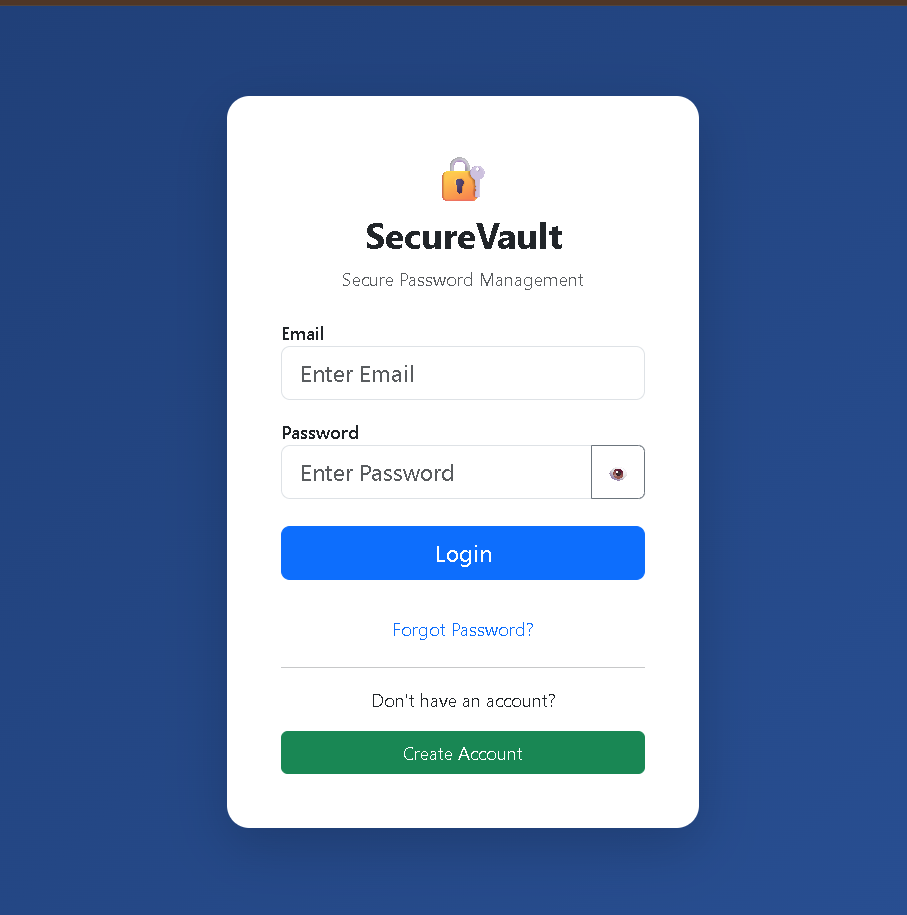
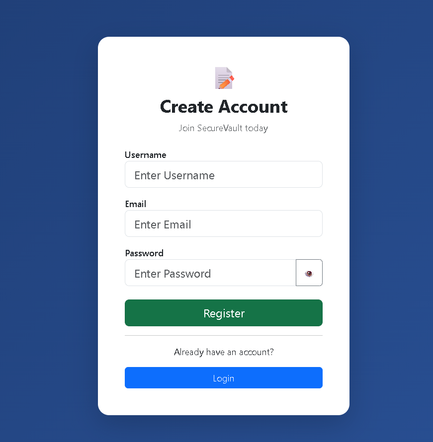
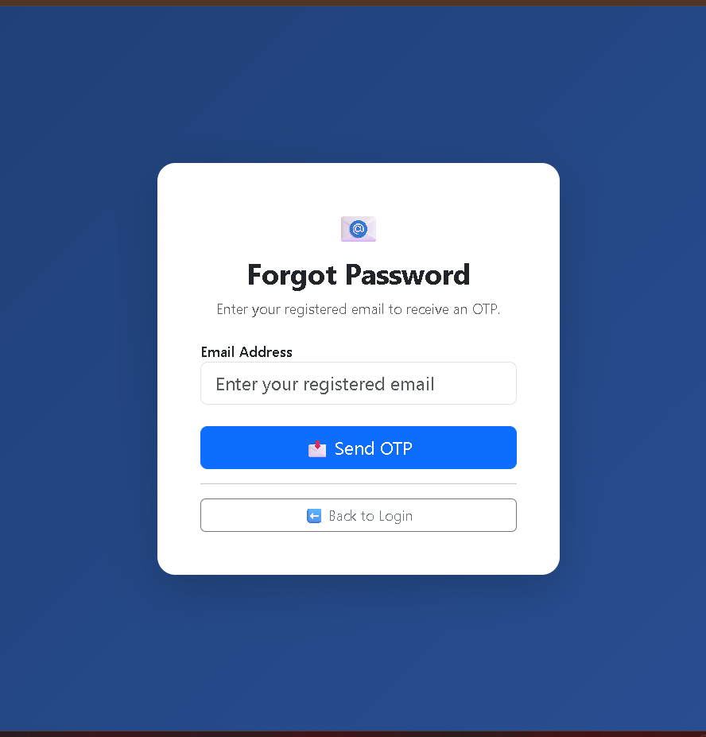
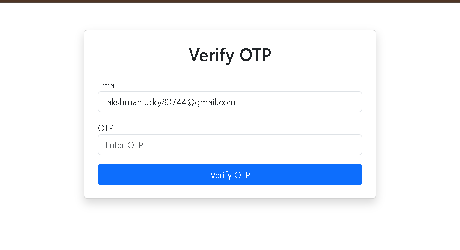
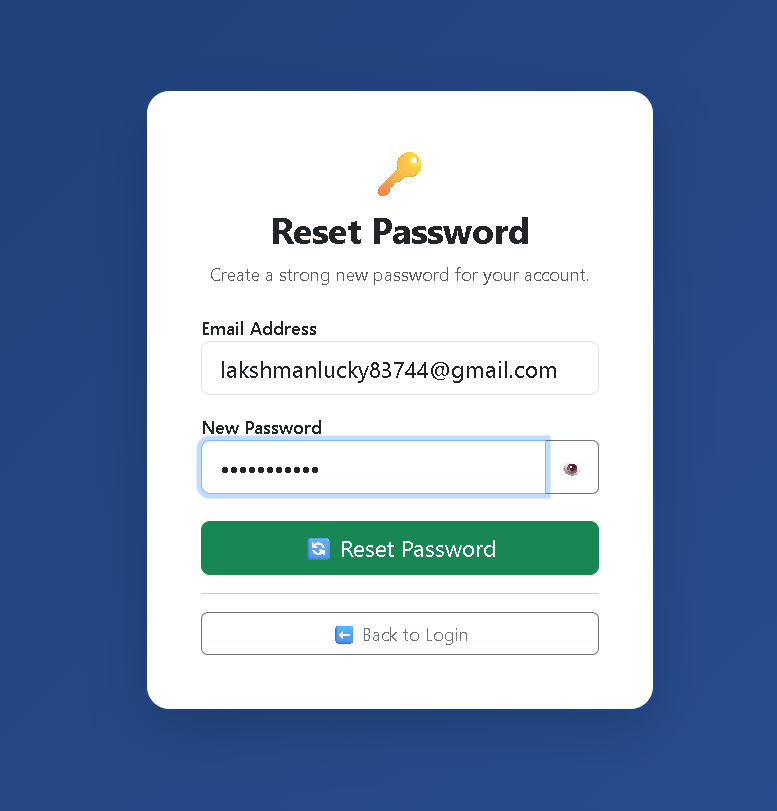
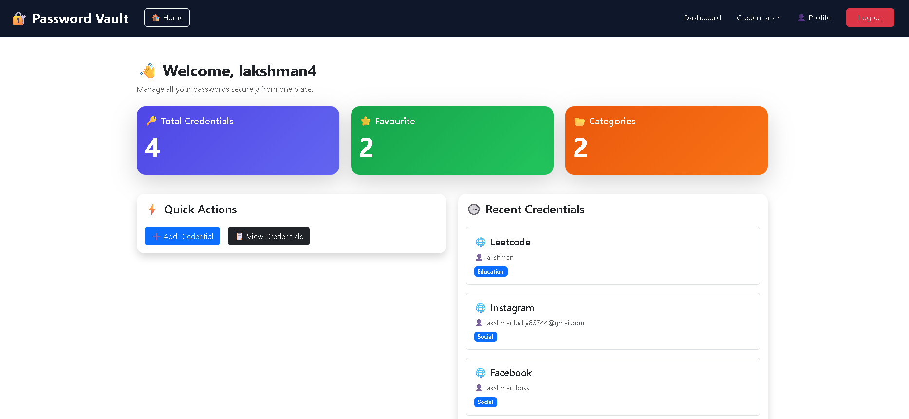
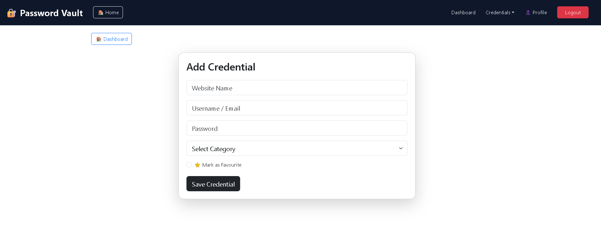
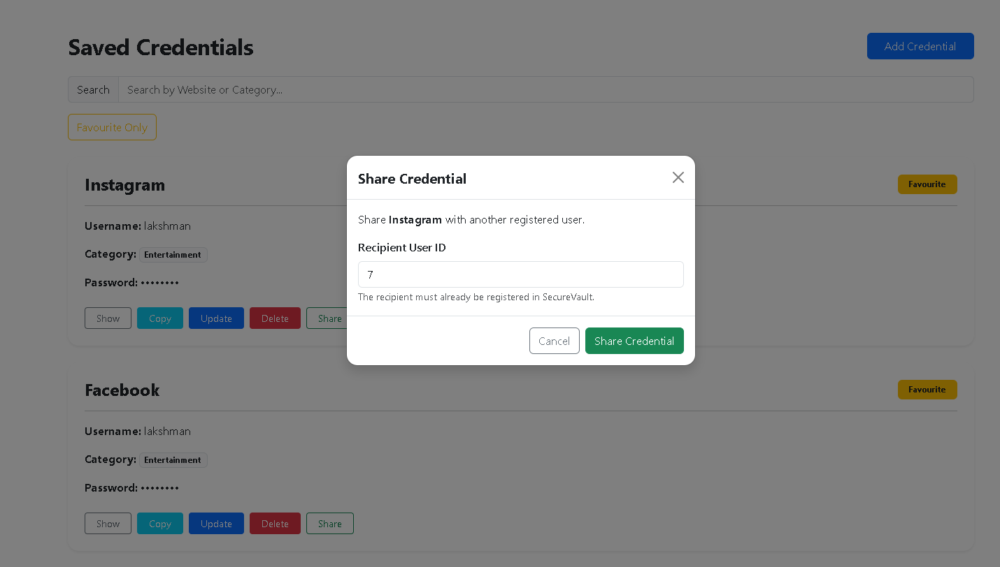
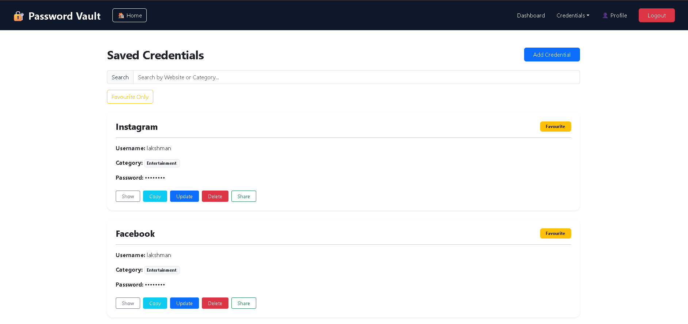
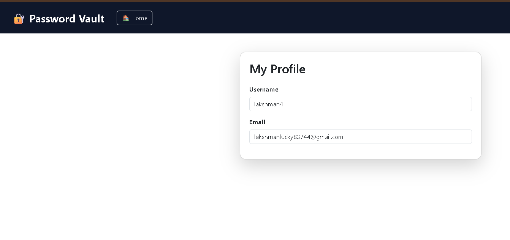

# SecureVault - Password Vault & Credential Management System

SecureVault is a full-stack Password Vault application built using React, Spring Boot, and PostgreSQL. It allows users to securely store, manage, and organize their credentials with OTP-based password recovery, AES encryption, password generation, password strength checking, and secure credential sharing with permission-based access control.

---

## Features

### Authentication

- User Registration
- Secure Login
- Forgot Password
- OTP Verification
- Reset Password
- Logout
- Protected Routes

### Credential Management

- Add Credentials
- View Credentials
- Update Credentials
- Delete Credentials
- Search Credentials
- Favourite Credentials
- Show / Hide Password
- Copy Password
- AES Password Encryption
- Password Generator
- Password Strength Checker

### Secure Credential Sharing

SecureVault allows users to securely share credentials with registered users.

Three permission levels are supported:

- **View Only** – Recipient can only view the shared credential.
- **Edit Access** – Recipient can view and edit the shared credential.
- **Full Management** – Recipient can view, edit, delete, and manage sharing of the credential.

The system checks the assigned permission before allowing the recipient to perform an action.

### Permission Workflow

```text
Owner Selects Credential
        ↓
Credential Already Shared
        ↓
Owner Assigns Permission
        ↓
View Only / Edit Access / Full Management
        ↓
Recipient Opens Credential
        ↓
System Checks Permission
        ↓
Allow / Deny Action

### Dashboard

- Total Credentials
- Favourite Credentials
- Categories Count
- Recent Credentials
- Quick Actions

### Profile

- View Username
- View Email

---

## Technology Stack

### Frontend

- React.js
- React Router DOM
- Axios
- Bootstrap 5

### Backend

- Spring Boot
- Spring Security
- Spring Data JPA
- Java Mail Sender

### Database

- PostgreSQL

---

## Project Structure

```text
SecureVault
│
├── frontend
├── backend
├── screenshots
└── README.md
```

---

## Screenshots

### Login



---

### Register



---

### Forgot Password



---

### Verify OTP



---

### Reset Password



---

### Dashboard



---

### Add Credential



---
### Share Credential



---
### Saved Credentials



---

### Profile



---

## Installation

### Clone Repository

```bash
git clone https://github.com/lakshmandhulipudi/SecureVault.git
```

### Backend

```bash
cd backend
mvn spring-boot:run
```

### Frontend

```bash
cd frontend
npm install
npm run dev
```

---

## Future Enhancements

- Website URL Support
- Notes for Credentials
- Import Credentials
- Export Credentials
- Dark Mode

---

## Author

**Dhulipudi Lakshman**

GitHub:  
https://github.com/lakshmandhulipudi 


